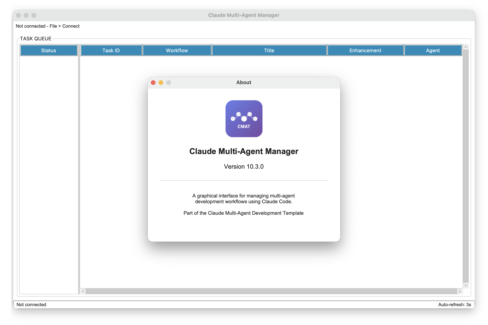
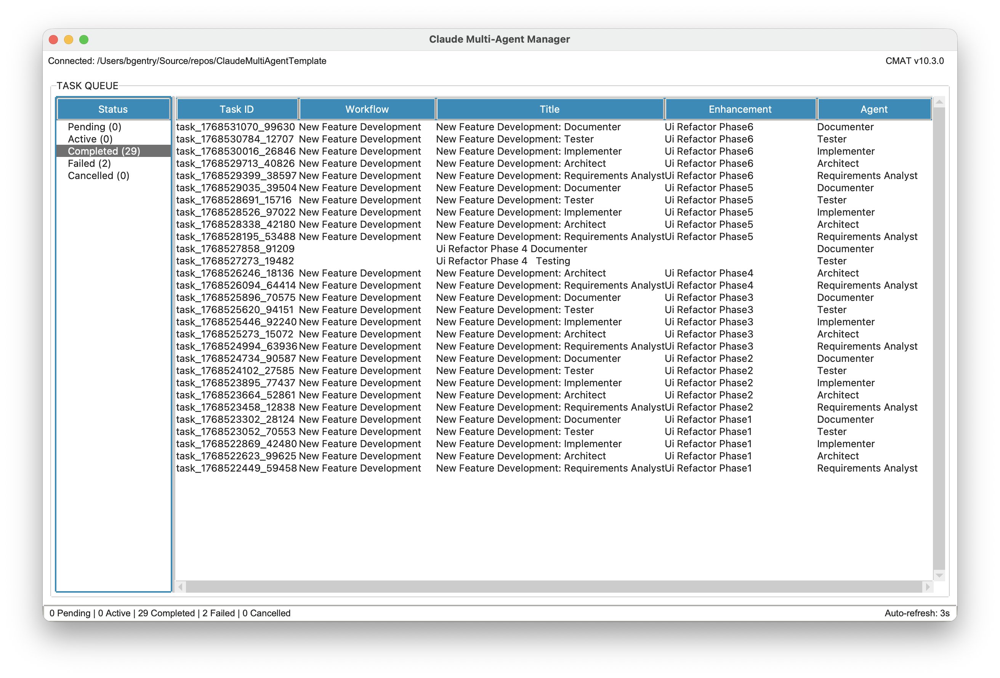
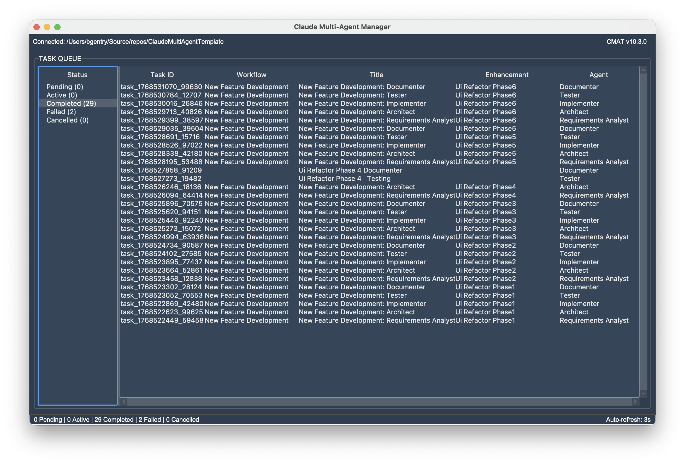

# Claude Multi-Agent Template (CMAT)

A workflow-based multi-agent development system with a graphical UI. CMAT provides specialized AI agents orchestrated by customizable workflow templates with automated validation, comprehensive skills, and intelligent learning.

**Version**: 10.7.0



---

## What Is This?

CMAT is a multi-agent system that breaks down software development into specialized roles, orchestrated by flexible workflow templates:

**Core Agents**:
- **Requirements Analyst**: Analyzes user needs and creates implementation plans
- **Architect**: Designs system architecture and technical specifications
- **Implementer**: Writes production-quality code
- **Tester**: Creates and runs comprehensive test suites
- **Documenter**: Maintains project documentation
- **Code Reviewer**: Reviews code for quality and security

**Specialist Agents**:
- **Security Auditor**: Security analysis, threat modeling, vulnerability scanning
- **Performance Engineer**: Profiling, optimization, load testing
- **Data Engineer**: Data modeling, ETL design, data quality
- **DevOps Engineer**: CI/CD, infrastructure-as-code, container orchestration
- **Accessibility Specialist**: WCAG compliance, screen reader testing
- **API Integration Specialist**: API integration, webhooks, rate limiting
- **Refactoring Specialist**: Code improvement, design patterns, tech debt

**Integration Agents**:
- **GitHub Integration Coordinator**: Syncs workflow with GitHub issues and PRs
- **Atlassian Integration Coordinator**: Syncs workflow with Jira and Confluence

**Skills System**: 38 specialized skills providing domain expertise, automatically injected into agent prompts.

---

## Features

### Core System
- **17 Specialized Agents** - Clear responsibilities, reusable across workflows
- **Graphical UI** - Full-featured tkinter interface for managing projects
- **Dark Mode Support** - 15 ttkbootstrap themes with live preview (View > Toggle Dark Mode or Ctrl+D)
- **Workflow Templates** - Define agent sequences, inputs, outputs, and transitions
- **Output Validation** - Automatic validation of required outputs
- **Automated Workflows** - Template-driven intelligent task chaining
- **Task Queue System** - Organize and track work
- **Skills System** - Domain expertise in reusable modules
- **Multiple Theme Support** - Light and dark themes with live preview

| Light Theme | Dark Theme |
|-------------|------------|
|  |  |

### Intelligence & Tracking
- **Learnings System** - RAG-based memory that improves over time
- **YAML Completion Blocks** - Structured status reporting from agents
- **Cost Tracking** - Automatic token usage and cost tracking per task
- **Model Management** - Configure and track Claude model pricing

### Integration
- **GitHub Sync** - Issues, PRs, and labels
- **Jira/Confluence Sync** - Tickets and documentation

---

## Prerequisites

- **Python 3.10+** - Core runtime
- **Claude Code** - Multi-agent orchestration platform
- **tkinter** - GUI framework (included with Python)
- **pyyaml** - YAML parsing for agents and workflows
- **pillow** - Image processing for UI icons
- **ttkbootstrap** - Modern UI themes with dark mode support

Optional:
- **Node.js 16+** - For MCP servers (GitHub/Jira integration)

---

## Installation

### Option 1: Install from Source (Development)

```bash
# Clone the repository
git clone https://github.com/anthropics/claude-multi-agent-template.git
cd claude-multi-agent-template

# Run the setup script (recommended)
./setup_dev.sh           # Linux/macOS
.\setup_dev.ps1          # Windows PowerShell

# Or manually:
# Create and activate virtual environment
python3 -m venv .venv
source .venv/bin/activate           # Linux/macOS
.\.venv\Scripts\Activate.ps1        # Windows PowerShell

# Install in editable mode
pip install -e .                    # Core only (just to run CMAT)
pip install -e ".[dev]"             # With dev tools (pytest, black, mypy, ruff)
```

**Note**: Always activate the virtual environment before running CMAT:
```bash
source .venv/bin/activate           # Linux/macOS
.\.venv\Scripts\Activate.ps1        # Windows PowerShell
cmat
```

**IDE Setup**: If using PyCharm, VS Code, or another IDE, configure the Python interpreter to use `.venv/bin/python` in the project directory.

---

## Quick Start

### 1. Launch the UI

```bash
cmat
```

**For a hands-on tutorial, it is recommended you follow [DEMO.md](DEMO.md) before starting on your own use.**

### 2. Install CMAT to a Project

In the UI:
1. **File > Install...** (or Ctrl+I)
2. Select your project directory
3. CMAT copies templates to `your-project/.claude/` and connects to it

### 3. Create an Enhancement

In the UI:
1. **File > New Enhancement**
2. Fill in the enhancement details
3. Enhancement is created in `your-project/enhancements/`

### 4. Start a Workflow

In the UI:
1. Select a workflow template
2. Select the enhancement
3. Click **Start Workflow**
4. Agents execute automatically

---

## Project Structure

### CMAT Repository

```
claude-multi-agent-template/
├── src/
│   ├── core/                     # Core CMAT services
│   │   ├── __init__.py
│   │   ├── cmat.py              # Main orchestration class
│   │   ├── models/              # Data models
│   │   ├── services/            # Service classes
│   │   └── utils.py
│   │
│   └── ui/                       # Graphical UI
│       ├── __init__.py
│       ├── main.py              # Entry point
│       ├── dialogs/             # UI dialogs
│       ├── models/              # UI models
│       └── utils/               # UI utilities
│
├── templates/                    # Copied to target projects
│   ├── .claude/
│   │   ├── agents/              # Agent definitions
│   │   ├── skills/              # Skills system
│   │   ├── data/                # JSON data files
│   │   └── hooks/               # Automation hooks
│   └── enhancement-templates/   # Enhancement templates
│
├── tests/                        # Test suite
├── docs/                         # Documentation
├── demo/                         # Demo calculator project
│
└── pyproject.toml               # Package configuration
```

### Target Project (after initialization)

```
your-project/
├── .claude/
│   ├── agents/                  # Agent definitions
│   ├── skills/                  # Skills
│   ├── data/                    # Queue, workflows, learnings
│   ├── hooks/                   # Automation hooks
│   └── logs/                    # Execution logs
├── enhancements/                # Feature requests
│   └── feature-name/
│       ├── feature-name.md     # Enhancement spec
│       ├── requirements-analyst/
│       ├── architect/
│       ├── implementer/
│       ├── tester/
│       └── documenter/
└── [your project files]
```

---

## System Architecture

### Service Layer

```
CMAT / CMATInterface
├── queue: QueueService       # Task state management
├── agents: AgentService      # Agent registry
├── skills: SkillsService     # Skills loading
├── workflow: WorkflowService # Orchestration
├── tasks: TaskService        # Execution
├── learnings: LearningsService # RAG memory
├── models: ModelService      # Model config & costs
└── tools: ToolsService       # Tool definitions
```

### Workflow-Based Design

```
Workflow Template
  │
  ├─ Step 0: requirements-analyst
  │    ├─ input: "enhancement spec"
  │    ├─ required_output: "analysis.md"
  │    └─ on_status:
  │         ├─ READY_FOR_DEVELOPMENT → Step 1 (auto)
  │         └─ BLOCKED → Stop
  │
  ├─ Step 1: architect
  │    └─ on_status:
  │         ├─ READY_FOR_IMPLEMENTATION → Step 2 (auto)
  │         └─ NEEDS_CLARIFICATION → Stop
  │
  └─ ... (continues through workflow)
```

### Agent Completion Blocks

Agents report status using YAML completion blocks:

```yaml
---
agent: implementer
task_id: task_1234567890_12345
status: READY_FOR_TESTING
---
```

**Completion statuses** (workflow continues):
- `READY_FOR_DEVELOPMENT` - Requirements complete
- `READY_FOR_IMPLEMENTATION` - Design complete
- `READY_FOR_TESTING` - Implementation complete
- `TESTING_COMPLETE` - Tests passed
- `DOCUMENTATION_COMPLETE` - Docs updated

**Halt statuses** (workflow pauses):
- `BLOCKED: <reason>` - Cannot proceed
- `NEEDS_CLARIFICATION: <question>` - Requires input
- `TESTS_FAILED: <details>` - Tests need attention

---

## Documentation

### Getting Started
- **[README.md](README.md)** - This file
- **[DEMO.md](DEMO.md)** - Hands-on demo walkthrough

### Reference Guides
- **[WORKFLOW_GUIDE.md](docs/WORKFLOW_GUIDE.md)** - Workflow patterns
- **[SKILLS_GUIDE.md](docs/SKILLS_GUIDE.md)** - Skills system
- **[QUEUE_SYSTEM_GUIDE.md](docs/QUEUE_SYSTEM_GUIDE.md)** - Task queue operations
- **[CUSTOMIZATION_GUIDE.md](docs/CUSTOMIZATION_GUIDE.md)** - Adapting to your project

### Features
- **[LEARNINGS_GUIDE.md](docs/LEARNINGS_GUIDE.md)** - RAG memory system
- **[COST_TRACKING.md](docs/COST_TRACKING.md)** - Token usage and costs
- **[INTEGRATION_GUIDE.md](docs/INTEGRATION_GUIDE.md)** - GitHub/Jira integration

---

## Development

### Running Tests

```bash
# Install with dev dependencies (includes pytest, black, mypy, ruff)
pip install -e ".[dev]"

# Run all tests
pytest

# Run with coverage
pytest --cov=core --cov=ui
```

### Project Setup

```bash
# Create virtual environment
python -m venv .venv
source .venv/bin/activate           # Linux/macOS
.\.venv\Scripts\Activate.ps1        # Windows PowerShell

# Install in development mode
pip install -e ".[dev]"
```

---

## Next Steps

1. **Try the Demo** - [DEMO.md](DEMO.md) - Hands-on walkthrough with the calculator project
2. **Customize** - [docs/CUSTOMIZATION_GUIDE.md](docs/CUSTOMIZATION_GUIDE.md) - Adapt for your project
3. **Learn Workflows** - [docs/WORKFLOW_GUIDE.md](docs/WORKFLOW_GUIDE.md) - Workflow patterns
4. **Explore Skills** - [docs/SKILLS_GUIDE.md](docs/SKILLS_GUIDE.md) - Domain expertise

---

## Links

- **Claude Code**: https://claude.ai/code
- **Complete Documentation**: See `docs/` directory
